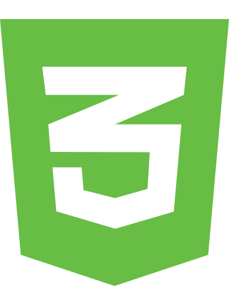
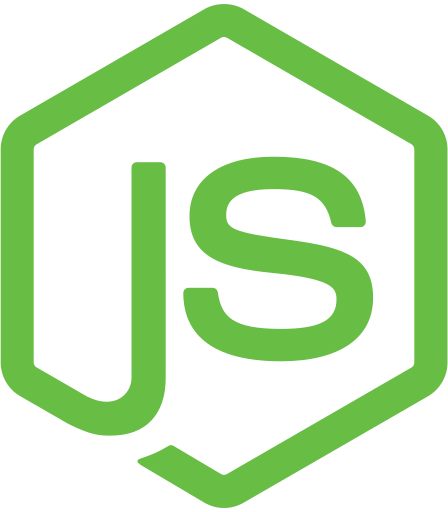
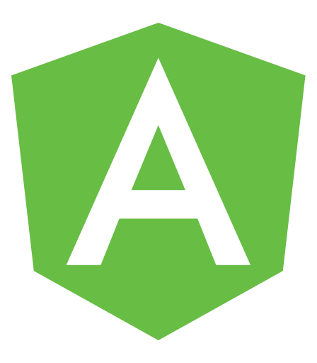

### Hi there 👋✨
<h1 align="center">Hi there! \o/ 👋 👩🏽‍🦱 :woman_technologist: - Welcome to my Github Profile! </h1>

    
    
  
 

## About me

> My name is Mayara Rysia, I'm 26 years old, and I'm from Brazil 🇧🇷
I'm a Computer Technician at IFAL and I'm an undergraduate student in the Bachelor of Information Systems course at IFAL. 

> I am passionate about technology, innovation, and self-improvement.  

> I am an enthusiast of STEM Education, Software Engineering, and Artificial Intelligence. I love to exchange knowledge and experiences.

> I also like flowers, music, series, movies, coffee, tea, the stock marketc and etc. 

 -  **Learning :** Angular :fire:
 -  **Skills :** Java, C, Python, JavaScript, SQL Databases, POO :gem:

## Main Technologies

  
  
  <!-- 
   -->
  <!--  -->
  <!-- 
  
   -->
  

  
<!--
**mayararysia/mayararysia** is a ✨ _special_ ✨ repository because its `README.md` (this file) appears on your GitHub profile.

Here are some ideas to get you started:

- 🔭 I’m currently working on ...
- 🌱 I’m currently learning ...
- 👯 I’m looking to collaborate on ...
- 🤔 I’m looking for help with ...
- 💬 Ask me about ...
- 📫 How to reach me: ...
- 😄 Pronouns: ...
- ⚡ Fun fact: ...
-->
